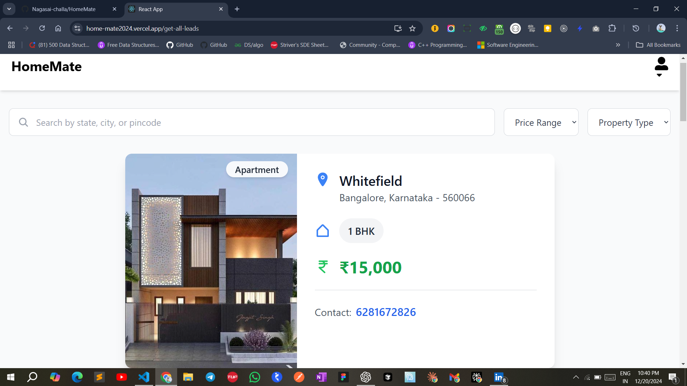
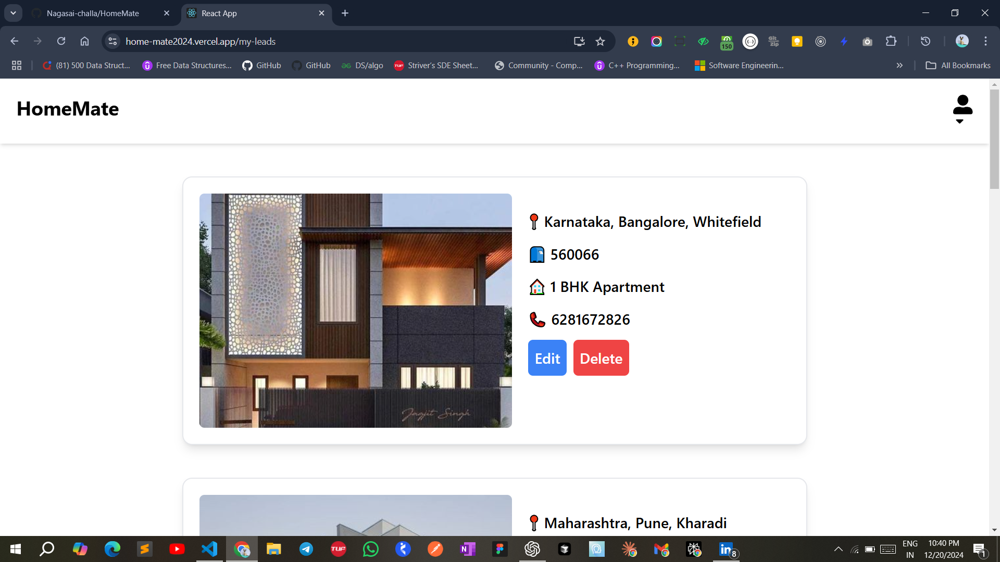
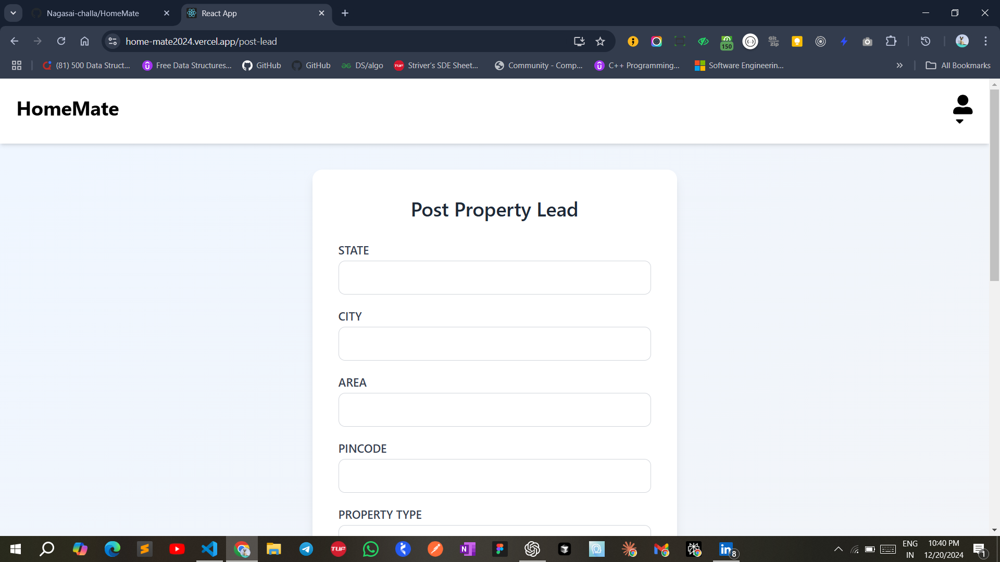

# Home Mate

## Introduction
Home Mate is a web-based platform designed to connect homeowners and renters, enabling seamless communication and collaboration for finding rental properties or sharing home spaces.

## Features
- **Property Listings**: Users can search, post, and view rental property listings.
- **User Profiles**: Create profiles to manage property details and search preferences.
- **Chat System**: Facilitates real-time communication between homeowners and renters.
- **Image Gallery**: Upload and showcase property images to enhance user experience.

## Technologies Used
- **Frontend**: React.js, Tailwind CSS
- **Backend**: Node.js, Express.js
- **Database**: MongoDB
- **Other**: Socket.IO for real-time communication, JWT for authentication

## Installation
1. Clone the repository:
   ```bash
   git clone https://github.com/your-username/home-mate.git
   cd home-mate
Install dependencies:

bash
Copy code
npm install
Set up your environment:

Create a .env file in the root directory.
Add necessary environment variables (e.g., database URI, JWT secret).
Start the server:
bash
Copy code
npm start
Usage
Visit Home Mate to access the Home Mate application.
Sign up or log in to start exploring property listings.
Interact with listings, upload your property images, and use the chat feature to communicate with other users.
Screenshots




Deployment
You can access the deployed Home Mate application at [ https://home-mate2024.vercel.app/](https://home-mate2024.vercel.app/).
